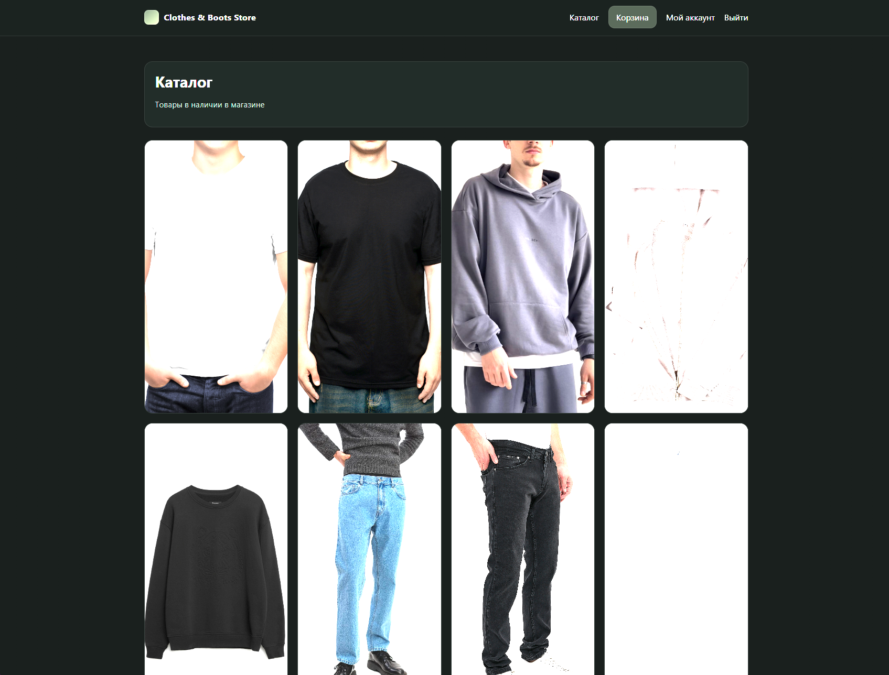
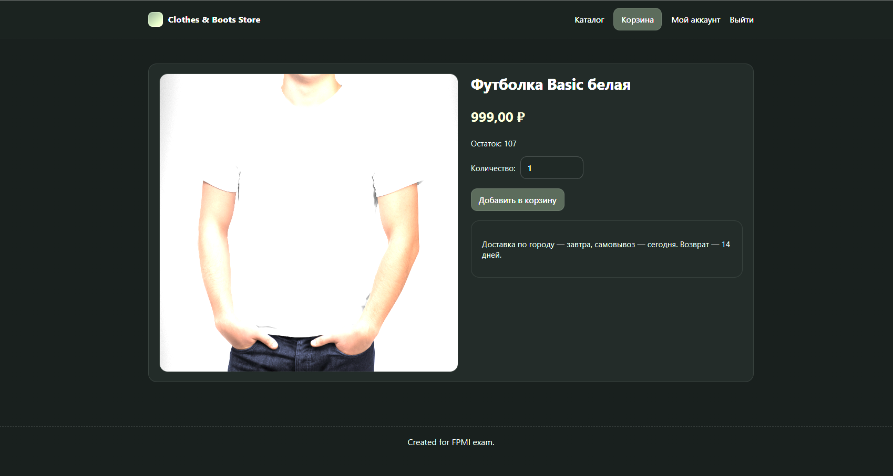
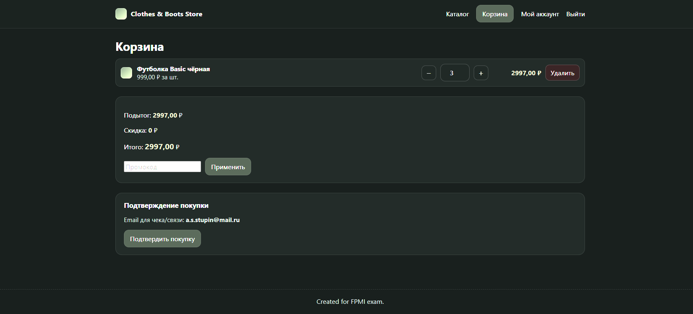
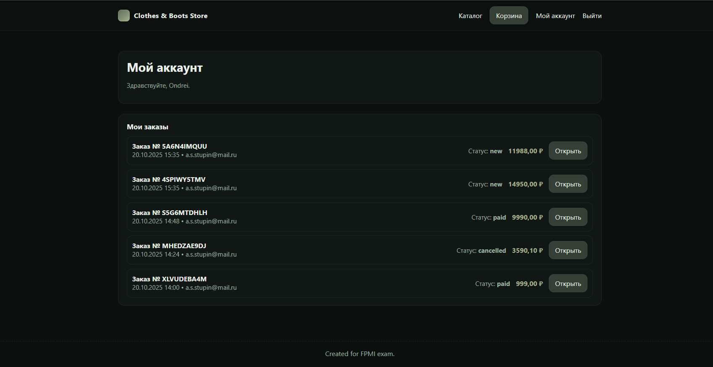

<p align="center">
  
</p>

<h1 align="center">🛍️ Items Shop</h1>

<p align="center">
  Минималистичный интернет-магазин на <b>Django</b> с корзиной, авторизацией и личным кабинетом.
  <br>
  Проект демонстрирует базовую бизнес-логику e-commerce: товары, заказы, купоны, регистрацию и оплату (без шлюза).
</p>

---

## 🌿 Скриншоты интерфейса

| Главная | Карточка товара | Корзина | Личный кабинет |
|----------|----------------|----------|----------------|
|  |  |  |  |

---

## 🚀 Быстрый старт (локально)

### 1️⃣ Репозиторий

```bash
  git clone https://github.com/marazoch/items_shop
  cd items_shop
```

### 2️⃣ Виртуальное окружение и зависимости

```bash
  python -m venv .venv
  .venv\Scripts\activate       # Windows
  # или source .venv/bin/activate для macOS/Linux

  pip install -r requirements.txt
```
### 3️⃣ Миграции и создание суперпользователя
```bash
  python manage.py makemigrations
  python manage.py migrate
  python manage.py createsuperuser
```
### 4️⃣ Тестовые данные

```bash
  python manage.py seed_shop
```

### 5️⃣ Запуск сервера
```bash
  python manage.py runserver
  #http://127.0.0.1:8000
```
---
### Docker
```bash
  cp .env.example .env
  docker compose build
  docker compose up -d
  docker compose exec web python manage.py migrate
  docker compose exec web python manage.py createsuperuser
```